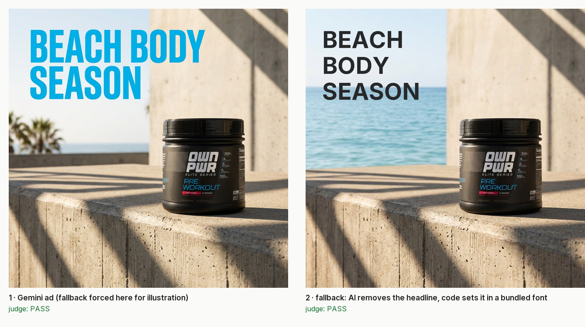
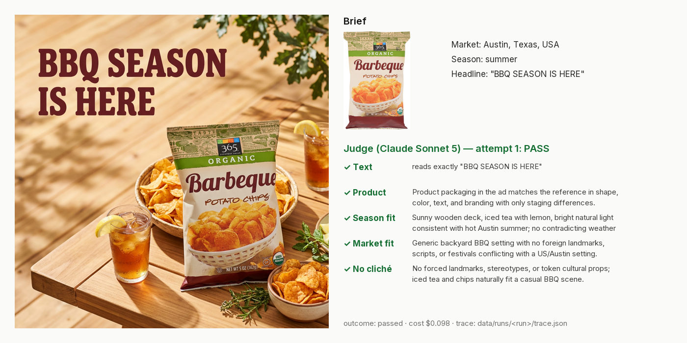

# Context-Enriched Ad Generation

Generate display ads from a **product photo + target geography + season + required headline**, and measure how far the quality check can be trusted. Every ad is judged for exact headline text, product fidelity and market/season fit. Failures are retried with the judge's critique, then fixed deterministically. The judge itself is scored against 109 human-labelled ads.



| Judge (Claude Sonnet 5): catch / pass rate | Text | Product | Context |
| :--- | :---: | :---: | :---: |
| **Dev** (56 items, used for tuning) | 100% / 100% | 83% / 100% | 94% / 100% |
| **Held-out test** (53 items, scored once) | **100% / 97%** | **73% / 96%** | **86% / 100%** |

- **Catch rate:** the share of real failures the judge flags.
- **Pass rate:** the share of good ads it lets through.
- **Cost:** one ad is about $0.07 and ~11 s to generate, plus about $0.03 to judge.

**Quick start:** `cp env.example .env` (add the LiteLLM proxy URL and key), then `docker compose up --build`, then open <http://localhost:8501>.

## Contents
1. [Problem](#1-problem) · 2. [Solution](#2-solution) · 3. [How we got here](#3-how-we-got-here) · 4. [Evaluation](#4-evaluation) · 5. [Run it](#5-run-it) · 6. [For evaluators](#6-for-evaluators) · 7. [Repository map](#7-repository-map) · 8. [Scale and production](#8-scale-and-production) · 9. [Limitations](#9-limitations-and-next-steps) · 10. [Data sources](#10-data-sources) · 11. [Troubleshooting](#11-troubleshooting)

---

## 1. Problem

| Requirement | Success criterion |
| :--- | :--- |
| Generate ads with **Gemini 3.1 Flash Image** from a reference product image + geography, season and text that must appear | every ad uses all four |
| Output at most **1K** (long edge ≤ 1024 px) | size gate in the evaluator |
| **Evaluate** context adherence, product fidelity and text rendering | one pass/fail verdict per check, with a reason |
| **Automated tests** proving the evaluator separates pass from fail | judge scored against human labels: tuned on dev, run **once** on a held-out test split |
| Text rendering won't always be perfect | blind transcription + exact code match, retry with critique, then a real-font overlay |

**Targets (set before tuning):** catch rate ≥ 0.9 on blatant and moderate failures; pass rate ≥ 0.85.

**What the data forced:**
- **Gemini rarely misspells a headline unprompted**, so text failures had to be **planted**: single-change edits with a known defect.
- **A single accuracy number hides a lopsided judge**, so we report catch and pass rates per check.
- **The labeller can judge cultural fit only for India.** Other cultures use labels from an expert model panel ("silver"), reported separately.
- **Dev and test are split by product**, so no ad and its edited copy land on both sides.

---

## 2. Solution

### 2.1 Generation



- **Planner** (Gemini 3.8 Flash) reads the brand's typography and tone **off the packaging**, then plans the scene, composition and headline placement.
- **Code** fills a fixed image prompt ([prompts/image.md](prompts/image.md)) with the exact headline, the product-fidelity rule and "no visible faces".
- **Gemini 3.1 Flash Image** renders the ad and picks the headline colour from the finished scene.

### 2.2 Evaluation



- **Text.** The judge **transcribes the headline without being told what it should say**, and code checks for an exact match:
  - case and spacing are ignored, and `’` = `'`
  - punctuation is strict: `SUMMER.`, `0FF` and duplicated words all fail
- **Product.** The judge compares the reference and the ad side by side: presence, shape, colour, logo, label/dial text, counts and parts. Staging (angle, light, snow) is allowed.
- **Context.** Three checks: season fit (hemisphere-aware), market fit (nothing contradicts the market) and no cliché (no forced landmarks or token props). Each problem belongs to exactly one check.
- **Judge model.** Claude Sonnet 5: a different family from the generator, and a different model from the expert panel.

### 2.3 Pipeline

```
generate → judge ─ pass ─────────────────────────────────► deliver
              └─ fail → retry with the judge's reasons (≤ 2) ─► deliver if it passes
                        └─ still failing → fallback (re-judged)
                             product → paste the real product cutout
                             text    → set the headline in a bundled font
```

The fallbacks guarantee the product and the words, at some cost to polish:



### 2.4 Apps (Streamlit)

- **Demo** ([app/demo.py](app/demo.py)): choose or upload a product, enter the brief, and watch each attempt with its five verdicts.
- **Labelling** ([app/label.py](app/label.py)): the tiered UI used to build the golden set.



---

## 3. How we got here

**Rule:** all decisions are made on dev. The test split is scored once, and label corrections are appended, never overwritten.

### 3.1 Research first
Details in [docs/research.md](docs/research.md):
- **Text:** transcription plus exact match beats asking a model "is this right?" (AnyText, MARIO-Eval).
- **Product:** side-by-side judging beats embedding similarity (DreamBench++).
- **Judges:** most reliable with binary verdicts and the reason written first.
- **Production:** systems composite the real product, which is the basis of our fallback.
- **Gap:** no public dataset combines product + geography + season + text + quality labels, so we built one.

### 3.2 The golden set



- **23 real products**, chosen for detail that generation tends to break: label text, glass, watch dials, knits, plaid, jewellery, and "illusion" products (moiré, holographic, mirror chrome, packaging that pictures other objects).
- **46 briefs** from a coverage grid: southern-hemisphere seasons, stereotype-risk markets, subtle seasons, currencies, non-Latin text, conflicts.
- **109 items:**
  - **46 final ads**
  - **24 failures** from earlier generation strategies
  - **39 planted edits:** typos, `0FF`, recolours, an extra adidas stripe, snow in summer, the Eiffel Tower in Kyoto…
- **Tiered labelling** (~25 min):
  - planted and earlier items get one yes/no question each
  - final ads are pre-filled by an expert panel (Claude Opus + GPT) and confirmed or flipped by the human
  - 10 items were labelled blind to measure anchoring

### 3.3 Choosing the generator
We compared nine prompt strategies on the same briefs, reviewing them by eye. Exact prompts are in [docs/prompt_history.md](docs/prompt_history.md).

| Strategy | Result |
| :--- | :--- |
| v1 "show this place" | postcard landmarks (Opera House, Hagia Sophia) |
| v2 "target market" | placeless scenes, faint headlines |
| v3–v6: local-cue checklists, token tests, "hands only", single call | token props (chai next to a moisturiser), placeless scenes, hands everywhere |
| **D2** ✅ planner + real places when they fit + text colour from the scene | clean, product-led, blended typography |

**Lesson:** short, concrete prompts beat rule lists, because every added rule gets over-applied.

### 3.4 Tuning the judge on dev, then one test run

| Judge prompt | Dev items fully right | Text | Product | Context |
| :--- | :---: | :---: | :---: | :---: |
| v1 | 68% | 91% / 100% | 80% / 92% | 81% / 93% |
| v2 (6 fixes from error analysis) | 84% | 100% / 92% | 90% / 96% | 88% / 100% |
| **v3** (frozen) | **95%** | 100% / 100% | 83% / 100% | 94% / 100% |

On the held-out test:
- **text and context held up**
- **product fell to 73%**, the cost of tuning on dev

<details>
<summary><b>Decision log</b></summary>

| Decision | Instead of | Why |
| :--- | :--- | :--- |
| Gemini renders, judge gates, deterministic fallback | pure Gemini / pure compositing | evaluation stays meaningful and output is still guaranteed |
| Blind transcription + exact code match | "is the text correct?" | models autocorrect when told the target |
| Strict punctuation, typographic variants equal | edit-distance tolerance | the labeller's ruling |
| Claude Sonnet 5 judge | Gemini (self-preference) / Opus (on the panel) | independence from the generator and the panel |
| Binary verdicts, one call per check | 1–10 scores | more reliable (MLLM-as-a-Judge) |
| Split by product | random split | prevents near-duplicate leakage |
| Charm on a bracelet = product fail | allow as staging | the labeller's ruling (a known judge miss) |
| Generator D2 | v1–v6, D | human review |

</details>

---

## 4. Evaluation

### 4.1 Dataset

| Source | Items | Labelled checks |
| :--- | :---: | :--- |
| Final D2 ads | 46 | all five |
| Earlier-strategy failures | 24 | the suspected check |
| Planted edits | 39 | the targeted check (others inherited from the base ad) |
| **Total** | **109** | dev 56 (11 products) · test 53 (12 products) |

**Failures per split:** text 10–11, product 10, context 14–16.

### 4.2 Scoring
- **Catch rate** is the TPR on true failures; **pass rate** is the TNR on true passes. Both are reported per check.
- **Unsure labels** are not scored.
- **The "independent" rows** exclude labels where the human kept the panel's pre-fill, which guards against circularity.
- **Judge results are cached per prompt version.** The test split refuses to run under any prompt version other than the frozen one.

### 4.3 Results (held-out test)

| Check | Catch (raw → adjudicated) | Pass (raw → adjudicated) | 95% CI (catch) |
| :--- | :---: | :---: | :---: |
| **Text** | 90% → **100%** (9/9) | 97% → **97%** | 0.70–1.00 |
| **Product** | 60% → **73%** (8/11) | 89% → **96%** | 0.43–0.90 |
| **Context** | **86%** (12/14) | **100%** | 0.60–0.96 |

- **By severity (planted):** blatant 100%, moderate 82%, subtle 83%.
- **Against the targets:** text meets them; context's catch rate (86%) is just under target; product misses (73%).
- **Main misses:**
  - **Product:** an added chain excused as "worn"; a recolour noticed then forgiven; garbled dial micro-text; one hallucination.
  - **Context:** the Taj Mahal accepted in a Mumbai ad; subtle summer foliage in a Vermont autumn; a token Club-Mate bottle.

**Adjudication.** After the test run, 4 disagreements were checked against the reference images. That corrected 3 labels and rejected 1 judge hallucination. Raw numbers are always shown alongside, and the raw labels are kept in `data/golden/ground_truth_raw_pre_adjudication.jsonl`.

**Pipeline runs** (traces in `data/runs/`):
- clean briefs pass first time (~$0.10)
- duplicated or garbled headlines are fixed in 1–2 retries ($0.20–0.29)
- fallbacks are re-judged as passing (~$0.20)

Full details: [docs/results.md](docs/results.md).

---

## 5. Run it

**Prerequisite:** a LiteLLM proxy routing to `vertex_ai/gemini-3.1-flash-image`, `vertex_ai/gemini-3.8-flash` and `anthropic/claude-sonnet-5`.
- Run `cp env.example .env` and set `LITELLM_BASE_URL` and `LITELLM_API_KEY`.
- Without a key, `test`, `verify` and `score` still work.

### Docker
```bash
docker compose up --build        # demo on http://localhost:8501
```

| Command | Does |
| :--- | :--- |
| `docker compose run --rm app verify` | dataset integrity check |
| `docker compose run --rm app test` | unit tests |
| `docker compose run --rm app score --split test --show-misses` | test scorecard from the committed results |
| `docker compose run --rm app pipeline b05 b25` | run the pipeline on briefs (needs the key) |
| `docker compose run --rm --service-ports app label` | labelling UI |

### Local
```bash
mise install && uv sync
mise run fetch          # the 23 reference photos
mise run app:demo       # http://localhost:8501
```

**Other tasks** (`mise tasks` lists them all):
- **Workflow:** `generate` · `plant` · `golden:build` · `golden:truth` · `eval:dev` · `eval:test` · `eval:score` · `pipeline`
- **Checks:** `verify` · `lint` · `test`

**Try it:** pick *365 BBQ chips*, then enter *Austin, Texas · summer · "BBQ SEASON IS HERE"*.

---

## 6. For evaluators

No API key or copyrighted images are needed:

| Claim | Command | Expected |
| :--- | :--- | :--- |
| Dataset is consistent | `mise run verify` | `ZERO DEFECTS` |
| Code is tested | `mise run test` | `66 passed` |
| Test numbers reproduce | `uv run python scripts/score_evals.py --split test` | text 100%/97%, product 73%/96%, context 86%/100% |
| Ground truth comes from the labels | `mise run golden:truth && git diff --stat` | no diff |
| Test is one-time | edit `prompts/judge_*.md`, then `mise run eval:test` | refuses |

**Enforced invariants:**
- no product appears in both splits
- the test split is only ever judged with the frozen judge prompts
- labels are append-only
- the headline is always inserted by code, never retyped by a model

---

## 7. Repository map

```
app/           demo.py · label.py
prompts/       every LLM prompt as a text template
src/adgen/     core/ (config, LLM client, briefs, checks) · generation/ (planner, generator, compositor)
               evaluation/ (judge, result cache, scoring) · golden/ (items, labels, panel, ground truth)
               pipeline.py
scripts/       one CLI per workflow step · docker-entrypoint.sh
evals/         promptfoo configs, provider, generated tests
tests/         66 unit tests
data/          briefs · products · ads (generation logs) · golden (labels, ground truth) · evals (judge results) · runs
docs/          design · research · results · guidelines · prompt history · data sources
assets/        diagrams · figures · fonts (OFL)
```

---

## 8. Scale and production

| Measured | Value |
| :--- | :--- |
| Generate one ad | $0.074, median 11.2 s |
| Judge one ad (3 calls) | $0.027 |
| Pipeline per brief | $0.10 (first-time pass) to $0.29 (2 retries) |
| Whole project, including experiments | ≈ $34 |

**At scale:**
- run the 3 judge calls in parallel
- try a cheaper judge for text, validated on dev first
- send product fails and a sample of passes to human review, and feed those labels back into the golden set
- re-run the frozen golden set on every prompt or model change

---

## 9. Limitations and next steps

- **Product fidelity is the judge's weak spot** (73% catch). Next: a deterministic crop + OCR comparison, with the judge as a second opinion.
- **Context misses landmark geography and subtle seasons.** Next: a landmark→city lookup and climate tables per market.
- **One labeller:** cultural ground truth exists for India only.
- **Small dataset:** wide confidence intervals.
- **Fallbacks are plainer** than generated typography.
- **Generation isn't deterministic:** the published judge results and image hashes are the reproducibility anchor.

---

## 10. Data sources

See [docs/data_sources.md](docs/data_sources.md):
- **20 reference photos** come from [Amazon Reviews 2023](https://huggingface.co/datasets/McAuley-Lab/Amazon-Reviews-2023). They are not redistributed; the ASINs and URLs are pinned in the manifest.
- **3 openly licensed photos** are committed: two from [Amazon Berkeley Objects](https://amazon-berkeley-objects.s3.amazonaws.com/index.html) (CC BY 4.0) and one from Open Food Facts (CC BY-SA 3.0).
- **Only the 15 ads derived from those 3 photos are committed.** Every image's SHA-256 is recorded in `data/golden/items.yaml`.
- **Trademarks** belong to their owners.
- **Fonts** are under the SIL OFL.
- **rembg** uses BRIA RMBG 2.0, licensed for non-commercial use only.

---

## 11. Troubleshooting

| Symptom | Fix |
| :--- | :--- |
| Demo asks for `LITELLM_BASE_URL` / `LITELLM_API_KEY` | add both to `.env` |
| `429 … limit: 0` | AI Studio's free tier has no image quota; use the proxy |
| "Image not included in the public repo" | expected for non-redistributed ads; get the reference photos with `mise run fetch` |
| `refusing to judge test item …` | by design; tune on dev |
| First product fallback is slow | rembg downloads a ~1 GB model once |
| Port 8501 in use | set `APP_PORT` in `.env` |
